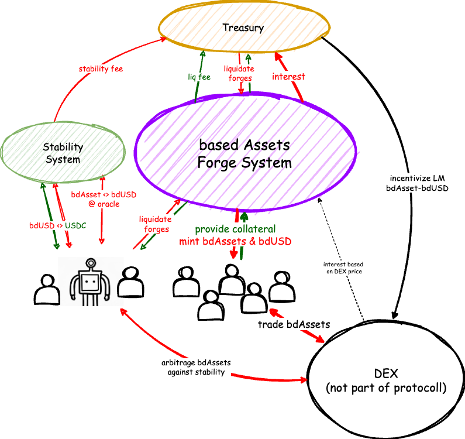

# Decentralized Loan Token System on Base: Technical Whitepaper

## Abstract
This document presents a decentralized lending system on the Base network, pioneering the fully decentralized creation of Real-World Asset (RWA) loan tokens through a dual-forge architecture anchored by an overcollateralized stablecoin, bdUSD. By integrating dynamic interest rates, an innovative Asset-Stability mechanism, and robust algorithmic controls, the system ensures stability while enabling users to mint bdUSD and RWA tokens against diverse crypto collaterals. Designed for flexibility and resilience, it offers a sustainable framework for decentralized finance, balancing user accessibility with sophisticated risk management.

## 1. System Overview
The system consists of two primary components:
1. A decentralized stablecoin (bdUSD) backed by crypto assets
2. Loan tokens (RWA) representing decentralized lending positions with oracle price references

### 1.1 Key Features
- Dual-forge system with different collateralization requirements
- Dynamic interest rate mechanism
- Asset-Stability feature for price alignment
- Multiple collateral options for both forge types
- Algorithmic bdUSD management system
- Treasury-driven fee collection and liquidation mechanisms



### 1.2 User Perspective
This section illustrates how users interact with the system through a practical example.

**Example: Alice’s Journey**
- **Step 1: Minting bdUSD**  
  Alice deposits 300 USDC into the bdUSD forge (minimum 120% collateralization). She mints 200 bdUSD, valued at $1 each, incurring a 0.1% base interest rate that adjusts dynamically based on market conditions (e.g., rising if bdUSD trades below $1).
- **Step 2: Creating an RWA Token**  
  Using her 200 bdUSD, Alice opens an RWA forge (meeting the 150% minimum). She mints an RWA token representing a $100 loan tied to an oracle-priced asset, with a 1% default interest rate.
- **Step 3: Use RWA Token**  
  Alice can now sell the RWA token and bet on falling prices or put the RWA into Liquidity Mining earning comission from the system.
- **Step 4: Liquidation Risk**  
  If Alice’s RWA forge drops below 150% collateralization (e.g., RWA token value increases), a liquidator could repay part of her loan with their funds, taking 10% of her excess collateral as a reward, while the forge retains the rest, improving its health.

**Example: Bob's Journey**
- **Step 1: Buying RWA token**  
  Bob uses the RWA pools on the DEX (provided by users like Alice) to buy RWA tokens. He might do this to speculate on short term profits, or to diversify his portfolio into different asset classes.
- **Step 2: Liquidity Mining**  
  Bob can now also put his RWA tokens into Liquidity Mining to earn cash flow on top of his portfolio value
- **Step 3: Price stability**  
  Asset Stability ensures that the RWA-bdUSD price is within the defined range (5% for medium volatile tokens) at least once a week. So Bob can be sure that his decentralized RWA portfolio keeps track with the real world prices.

These examples show how users can leverage the system for lending and stability while managing risks.

## 2. bdUSD Stablecoin

### 2.1 Creation Methods
bdUSD can be created through two distinct mechanisms:

1. **Forge Minting**
   - Supported collaterals: USDC, cbBTC, wETH
   - Minimum collateralization ratio: 120%
   - Users can mint bdUSD against deposited collateral
   - bdUSD is always valued at $1 in the forge

2. **Stability Module**
   - Direct USDC-to-bdUSD conversion
   - 5% conversion fee (decreasing over time)
   - Bidirectional conversion (mint/burn)
   - Burn operation available when USDC exists in stability pool

### 2.2 Interest Rate Mechanism
- Base interest rate: 0.1%
- Dynamic interest rate component:
  - Negative when bdUSD trades at premium (up to -200% at 20% premium)
  - Positive when bdUSD trades at discount (up to 5000% at 100% discount)
  - Based on bdUSD/USDC DEX pool price

### 2.3 Algorithmic bdUSD
Algorithmic bdUSD represents the portion of bdUSD supply not backed by collateral but created through mechanisms like negative interest rates or token-to-bdUSD conversions. It’s calculated as:

```
BackedValue = TotalUSDLoans + USDValueInStability
AlgorithmicUSD = TotalUSDSupply - BackedValue
AlgoRatio = AlgorithmicUSD / TotalUSDSupply
```
To manage high AlgoRatios, a dynamic fee applies to actions increasing it (e.g., loan paybacks, stability burns, LoanToken-to-bdUSD conversions). These fees are burned to reduce AlgoRatio. 

The dynamic fee is calculated as:

`dynFee= ((algoRatio - 0.1)^2)/4`

See the table below for fee scaling in the Asset-Stability mechanism:

**Dynamic Fee Multiplier Table**  
| AlgoRatio Range | Dynamic Fee | AssetStability Fee Multiplier       | bdUSD Generation Status |
|-----------------|-------------|-------------------------------------|-------------------------|
| 0-10%           | 0% | 1.0x (base fee)     | Enabled                 |
| 10-50%          | 0% - 4% | 1.0x to 2.0x (linear increase) | Enabled       |
| 50%-100%        | 4% - 20% | 2x                 | Disabled                |

*Example*: At 30% AlgoRatio, the Asset stability multiplier is 1.5x, scaling fees proportionally. 

## 3. LoanToken (RWA) System

### 3.1 RWA Forge Specifications
- Supported collaterals: bdUSD, cbBTC, wETH
- Minimum collateralization ratio: 150%
- Valuation mechanism:
  - bdUSD valued at $1
  - Other assets valued at oracle price in $

### 3.2 RWA Token Interest
- Default interest rate: 1%
- Flexible rate structure allowing future adjustments based on:
  - Market demand
  - Price dynamics

## 4. Asset-Stability Mechanism

### 4.1 Operation
- Conversion once per week
- Bidirectional conversion between loan tokens and bdUSD
- Pre-lock requirement before conversion block
- Post-conversion claim process
- May generate algorithmic bdUSD
- Operation limitations:
  - Completely disabled for bdUSD generation when AlgoRatio > 50%
  - Fee multiplier applied between 10-50% AlgoRatio

### 4.2 Fee Structure
The Asset-Stability mechanism incurs fees based on asset volatility and AlgoRatio. Base fees reflect asset risk, while dynamic multipliers adjust for system stability, as shown below:

**Base Conversion Fee Table**  
| Asset Volatility | Base Fee |
|-------------------|----------|
| Low              | 2%       |
| Medium           | 5%       |
| High             | 15%      |

**Dynamic Fee Multiplier** (Cross-referenced from Section 2.3)  
- 0-10% AlgoRatio: 1.0x base fee  
- 10-50% AlgoRatio: Linear increase from 1.0x to 2.0x (e.g., 1.5x at 30%)  
- Above 50% AlgoRatio: bdUSD generation disabled  

*Example*: Converting a high-volatility RWA token (15% base fee) at 30% AlgoRatio incurs a 1.5x multiplier, resulting in a 22.5% total fee.

### 4.3 Volume Limitations
- Maximum conversion volume per period: 10% of total bdUSD supply
- Applies to net bdUSD delta in each stability period

## 5. Treasury System

### 5.1 Revenue Streams
- All system fees directed to treasury (bdUSD- and asset stability fees)
- Interest payments from both forge types
- 10% of overcollateral from liquidations with user funds
- Collateral + 15% of overcollateral from liquidations via treasury funds
- Exception: Dynamic bdUSD fees are burned directly

### 5.2 Treasury Operations
- Can initiate liquidations
- Receives collateral and liquidation rewards from treasury-initiated liquidations
- Can incentivize liquidity mining for LoanToken-bdUSD pools via treasury funds
- Might burn LoanTokens to reduce AlgoRatio

## 6. Liquidation Mechanism
When a forge falls below minimum collateral ratio, anyone can trigger a (partial) liquidation, either with their own funds or via treasury funds. Both methods pay part of the overcollateralization as an incentive/fee, with the remainder staying in the forge to increase its collateral ratio, improving forge health with each partial liquidation.

### 6.1 User-Funded Liquidations
- Liquidator pays back portion/full loan amount
- Receives corresponding collateral plus rewards:
  - 10% of overcollateral as liquidation incentive
- 10% of overcollateral goes to treasury

### 6.2 Treasury-Initiated Liquidations
- Uses treasury funds to pay back portion/full loan amount
- Treasury receives:
  - Corresponding collateral
  - 15% of overcollateral
- Liquidator receives:
  - 5% of overcollateral as compensation for triggering the liquidation


## 7. Risk Management

### 7.1 Collateral Risk
- Multiple high-quality collateral options
- Conservative collateralization ratios
- Oracle-based price feeds for valuation
- Liquidation mechanisms for undercollateralized positions

### 7.2 Stability Risks
- Volume limitations on Asset-Stability
- Fee structure discouraging excessive arbitrage
- Dynamic interest rates for market alignment
- Algorithmic bdUSD monitoring and fee system

## 8. Stock Split Handling
RWAs tied to equities require split handling. The system is prepared to handle both forward and reverse stock splits.

### 8.1 Split Initialization Process
1. **Oracle Deactivation**
   - Oracle for affected token is deactivated
   - Prevents creation of new loans
   - Existing loans and paybacks remain functional
2. **Split Registration**
   - Stock split info recorded in the asset system
   - Includes split ratio and new token specs
   - Automatically:
     - Creates new LoanToken with same interest as old token
     - Deactivates old token for new loans
     - Deactivates asset-stability for old token
     - Activates asset-stability for new token with identical fee structure
3. **Oracle Transition**
   - After new price data is available:
     - Old token oracle receives multiplier to match new pricing and is reactivated
     - New token oracle is activated
     - System maintains price consistency across transition

### 8.2 Token Conversion Process
1. **User Token Conversion**
   - Users convert old tokens to new via the asset system
   - Conversion ratio based on split definition
   - Old tokens burned; new tokens minted per split ratio
   - No fee on split conversion
2. **Forge Loan Conversion**
   - Forge owners convert loans to new token denomination
   - Whole loan converted at once
   - Maintains loan-to-collateral ratios and forge health
   - Optional but recommended for active forges
3. **Liquidation Protection**
   - Anyone can trigger split conversion for liquidatable forges
   - Ensures liquidation remains possible if old tokens become unavailable
   - Preserves system security and stability during transitions

### 8.3 Split Impact Management
1. **System Parameters**
   - Collateralization ratios unchanged
   - Interest rates carry over to new tokens
   - Asset-stability fees maintain consistency
2. **Risk Management**
   - Continuous oracle price monitoring during transition
   - Automatic validation of conversion transactions
   - Protection against split-related arbitrage

## 9. Conclusion
This system provides a framework for decentralized RWAs based on loan tokens while maintaining stability through multiple mechanisms. The dual-forge architecture, combined with stability modules, dynamic interest rates, and sophisticated liquidation mechanisms, creates a sustainable ecosystem for both stablecoin and loan token operations. The treasury system and algorithmic bdUSD management provide additional layers of security and sustainability.

## 10. Benefits for the Ecosystem

The decentralized Asset system introduces a transformative approach to Real-World Asset (RWA) tokenization and lending, delivering tangible advantages to users, protocols, and the broader DeFi ecosystem. By leveraging a dual-forge architecture, dynamic pricing mechanisms, and user-driven minting, the system creates opportunities for participation, innovation, and financial empowerment. Below are the key benefits:

### 10.1 Universal Access to Rising Asset Values
- **Decentralized and Uncensorable**: Anyone with an internet connection can participate, free from intermediaries or geographic restrictions. The system operates 24/7 on the Base network, ensuring constant availability without downtime or censorship.
- **Profit from Growth**: Users can mint, trade, or hold RWA tokens tied to real-world assets, benefiting from potential price increases in a transparent, decentralized marketplace.

### 10.2 Flexible Trading Opportunities
- **Long and Short Positions**: Users can speculate on RWA price movements by going long (buying tokens to profit from rising prices) or shorting (selling tokens to capitalize on declines). This flexibility empowers users to adapt to market conditions, whether bullish or bearish.
- **Portfolio Diversification**: With RWAs representing various asset classes, users can build diversified portfolios, reducing risk and tapping into multiple markets—all within a single decentralized system.

### 10.3 Loose Oracle Coupling for Regulatory Flexibility
- **Innovative Price Connection**: RWA tokens are loosely tied to oracle prices without a fixed peg, offering a unique balance of real-world relevance and regulatory independence. This makes them ideal for protocols needing stock or asset price exposure without directly referencing regulated markets.
- **Cross-Protocol Utility**: Other DeFi platforms can integrate RWAs as collateral, price feeds, or yield-bearing assets, fostering interoperability while sidestepping compliance hurdles tied to traditional financial instruments.

### 10.4 Be Your Own Broker with Real Yield
- **Self-Directed Finance**: Users can mint RWAs via forges and manage their own lending positions, effectively acting as their own brokers. This eliminates reliance on centralized institutions and puts control in the hands of individuals.
- **Earn Passive Income**: By staking RWA tokens in Liquidity Mining pools, users earn commissions from system fees and trading activity. This provides a real, sustainable yield on diversified bdAsset portfolios, rewarding active participation.

### 10.5 Enhanced Stability and Resilience
- **Dynamic Stability Mechanisms**: The Asset-Stability mechanism and dynamic interest rates ensure RWA prices align with market trends over time, while bdUSD remains a reliable anchor. This stability protects users and supports long-term ecosystem health.
- **Robust Risk Management**: Overcollateralization, liquidation incentives, and treasury operations safeguard the system against volatility, ensuring it remains solvent and trustworthy even in turbulent markets.

### 10.6 Empowerment Through Ownership
- **User-Driven Minting**: The forge system democratizes asset creation—anyone can mint RWAs or bdUSD with supported collateral, lowering barriers to entry and encouraging widespread adoption.
- **Community Governance Potential**: While not yet implemented, the treasury’s role in fee allocation and liquidity incentives lays the groundwork for future community-driven decision-making, aligning the system with DeFi’s ethos of decentralization.

### 10.7 Economic Efficiency and Innovation
- **Low-Cost Operations**: By running on Base, the system minimizes transaction costs, making it affordable for users to mint, trade, and manage RWAs. This efficiency drives higher participation and liquidity.
- **Catalyst for New Use Cases**: The availability of decentralized RWAs unlocks opportunities for developers to build novel applications—such as synthetic derivatives, insurance products, or tokenized real estate—expanding the boundaries of DeFi.

### 10.8 A Sustainable Financial Future
- **Scalable Framework**: The dual-forge design and algorithmic bdUSD management provide a scalable foundation that can accommodate growing demand and new asset types without compromising stability.
- **Incentivized Participation**: Liquidators, liquidity providers, and forge operators all benefit from clear incentives (e.g., liquidation rewards, mining yields), creating a self-sustaining ecosystem where every role contributes to overall success.

By combining accessibility, flexibility, and resilience, this system redefines how users interact with real-world assets in a decentralized context. It not only empowers individuals to take charge of their financial strategies but also strengthens the DeFi landscape by offering a versatile, stable, and innovative platform for asset tokenization and lending.